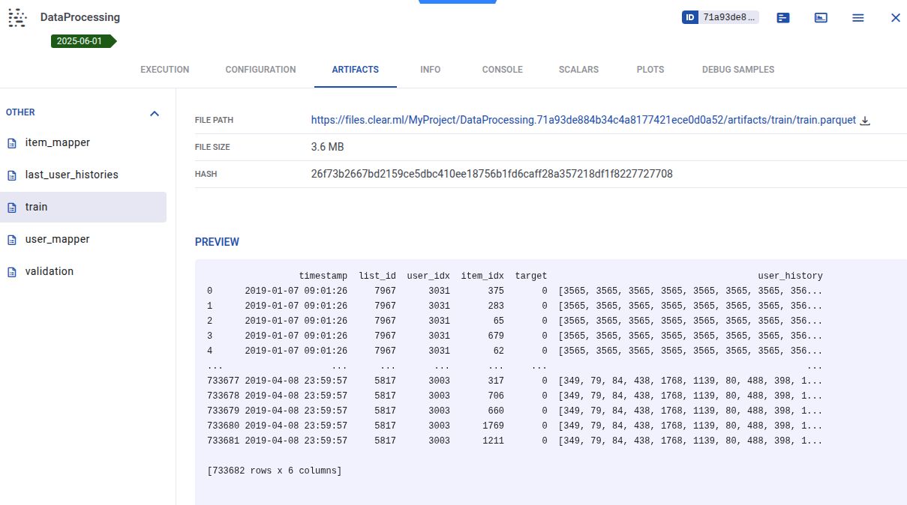
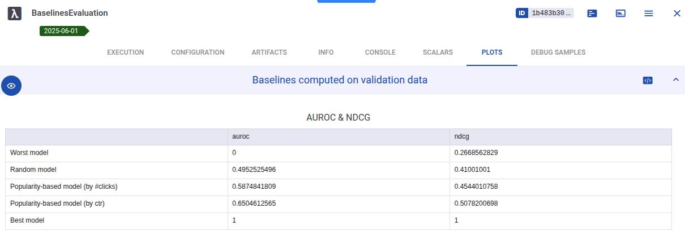
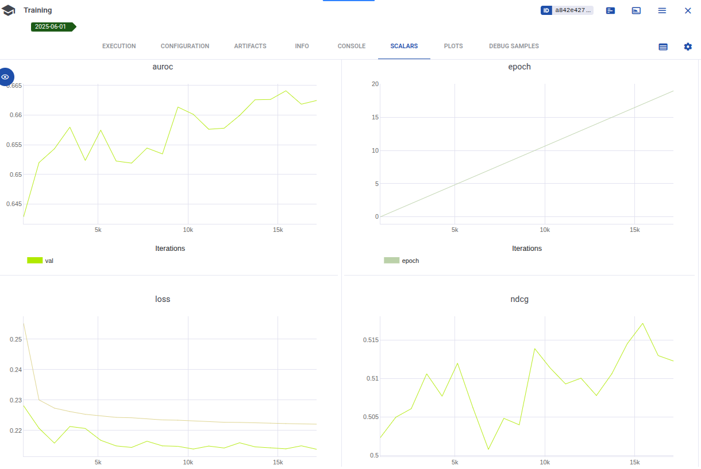

<div align="center">

# 🚀⚡🔥 Recommender System Template 🚀⚡🔥

[](https://github.com/pre-commit/pre-commit)
[](https://pytorch.org)
[](https://hydra.cc)
[](https://black.readthedocs.io)
[](https://github.com/krystianfranus/data-science-template/actions/workflows/workflow.yaml)
[](https://opensource.org/licenses/MIT)

</div>

This repository provides a modular template for building recommender systems in Python using **implicit feedback data**. It is designed to streamline experimentation of recommendation models with a modern ML stack.

### 🔧 Tech Stack
- **PyTorch Lightning** – for scalable and structured model training
- **Hydra** – for flexible configuration management
- **ClearML** – for experiment tracking and ML workflow orchestration
- **(Optional) AWS S3** – for storing datasets and models remotely

### 📦 Dataset

As an example, this template uses the [ContentWise Impressions](https://github.com/ContentWise/contentwise-impressions) dataset - a collection of implicit interactions and impressions of movies and TV series from an Over-The-Top media service, which delivers its media contents over the Internet. ***In the preprocessing phase the dataset is being limited to content of movies only.***

Exporatory data analysis can be found in [contentwise_eda.ipynb](notebooks/contentwise_eda.ipynb).

### 🚀 Use Cases

- Rapid prototyping of recommender systems
- Benchmarking implicit models
- Educational purposes (learning modern ML tools in practice)

---

More details about setup, usage, and customization can be found in the sections below.


## Prerequisites

To make use of this repository, follow these steps:

1. **Download the dataset**  
   Download the [ContentWise Impressions dataset](https://github.com/ContentWise/contentwise-impressions), specifically the `CW10M` directory.  
   Place it in the following path: `cache/data-cw10m/`

2. **Set up external services**  
- Configure your connection to a ClearML server for experiment tracking.
- (Optional) Set up access to AWS S3 if you want to use remote storage for data or/and models.


## Configuration and installation

Prepare environment variables related to ClearML and AWS in .env (see .env.example):
```
CLEARML_CONFIG_FILE=clearml.conf
CLEARML_WEB_HOST=<your-clearml-web-host>
...
```

Create and activate virtual environment with conda:
```
conda create --name <env_name> python=3.13.2
conda activate <env_name>
```

Install with pip:
```bash
pip install .  # Add flag -e to install in editable mode
```

(Optional) Using docker compose:
```bash
docker compose up -d  # Run container based on docker-compose.yml
```

(Optional) Using plain docker:
```bash
docker build -t ds-image .  # Build image defined in Dockerfile 
docker run -dit --gpus all --name ds-container ds-image  # Run container based on that image
```

## Run pipeline steps

### 1. Data preparation

```bash
python steps/process_data.py
```

After running this script the following datasets are being generated:
- `train.parquet` - behavioral data about 'movies consumption' for training (implict feedback)
- `validation.parquet` - behavioral data for validation
- `user_mapper.parquet` - user name to user index mapper
- `item_mapper.parquet` - item name to item index mapper
- `last_user_histories.parquet` - histories of last *n* consumed item per user - computed on train data



### 2. Baselines evalution

```bash
python steps/evaluate_baselines.py
```

Offline metrics (AUROC & NDCG) of baselines solutions:



### 3. Train

Training MLP based on user histories for 20 epochs:

```bash
python steps/train.py experiment=mlp_with_history trainer.max_epochs=20
```



### 4. Rest of the steps

```bash
python steps/optimize_hparams.py
python steps/infer.py
python steps/serve.py
python steps/run_pipeline.py
```

## Other useful commands:

```bash
docker exec -it ds-container bash  # Execute bash in a running container
docker compose start/stop/down
docker builder prune  # Remove build cache
```
